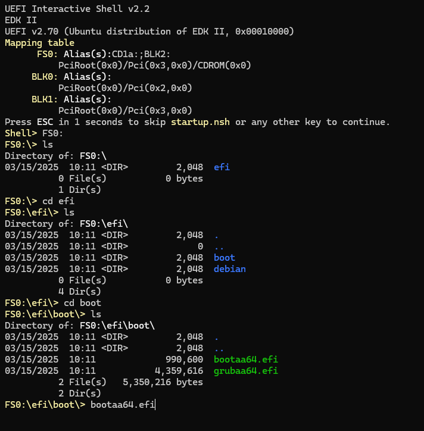
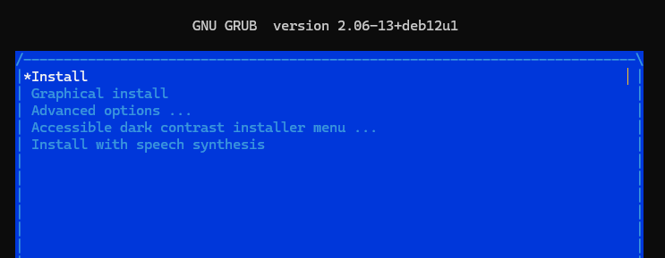
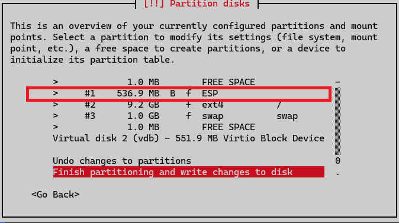
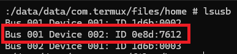
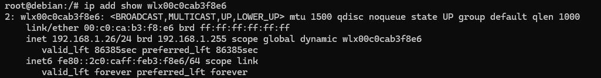

# Run a custom Linux Image in Andorid Virtualization Framework (AVF) with USB attachment

## Description


```
Disclaimer:


```
## Dependicies

- Linux development system with QEMU arm64 packages installed.
- Linux ISO image.  Debian is used for this guide.
- AVF [u-boot]() image. 
- [Rooted](https://xdaforums.com/t/guide-unlock-bootloader-root-google-pixel-tablet-with-magisk-adb-fastboot-command-lines.4615841/) Android version 14/15 device.  Google Pixel tablet is used for this guide.
- [F-Droid](https://f-droid.org/en/) installed on the rooted Android device.
- [Termux](https://f-droid.org/en/packages/com.termux/) installed on the rooted Android device.
- USB Debugging enabled in developer options on the Android system.
- [Android SDK Platform Tools](https://developer.android.com/tools/releases/platform-tools) installed on the development machine.
- [Google USB Driver](https://developer.android.com/studio/run/win-usb)


## Step by step process

### Build custom ARM64 Linux image

```
Note:

In this guide, debian-12.10.0-arm64 (bookworm) iso image to build the rootfs for the Linux image.   This should work for any Linux arm64 distro.
```

```
Note:

In this guide, the Linux development environtment is Ubuntu 24.0.2.

```

1. Start up your Linux development enironment.

2. Confirm the following packages are installed for QEMU arm64.

```
sudo apt update
sudo apt install qemu-system-arm qemu-utils edk2-aarch64
```

3. Create a working directory in your home location

```
mkdir ~\avf_custom_image
cd ~\avf_custom_image
```

4. Download your Linux disto.

```
wget https://cdimage.debian.org/debian-cd/current/arm64/iso-cd/debian-12.10.0-arm64-netinst.iso
```

5. Since this QEMU VM instance will boot using an EFI firmware, copy the files to the working directory.

```
sudo cp -p /usr/share/AAVMF/AAVMF_CODE.fd ./AAVMF_CODE.fd
sudo cp -p /usr/share/AAVMF/AAVMF_VARS.fd ./AAVMF_VARS.fd
```

6. Make VARS file writable by your user (QEMU needs to write UEFI vars here).

```
sudo chown $USER:$USER AAVMF_VARS.fd
sudo chown $USER:$USER AAVMF_VARS.fd
```

7. Build your rootfs file used by QEMU.

```
qemu-img create -f raw ./debian-arm64.img 10G
```

8. Boot the customer Linux AVF installation.

```
qemu-system-aarch64 \
  -machine virt \
  -cpu cortex-a57 \
  -m 2G \
  -nographic \
  -drive if=pflash,format=raw,readonly=on,file=AAVMF_CODE.fd \
  -drive if=pflash,format=raw,file=AAVMF_VARS.fd \
  -drive file=debian-arm64.img,format=raw,if=virtio \
  -cdrom debian-12.10.0-arm64-netinst.iso \
  -device virtio-net-device,netdev=net0 \
  -netdev user,id=net0 \
  -device virtio-rng-pci \
  -boot order=d
```

9. Since this Debian distro boot parition file can't be located on the cd-rom, it will have to be manually executed.



```
cd FS0:\efi\boot\
ls
bootaa64.efi
```

10. Select non-graphical installation since QEMU was not setup for a virtualized graphic card.



11. Follow the installation instructions. You MUST create an ESP boot partion since this Linux image will boot from a UEFI firmware.




```
Note:

If you need to end the QEMU VM, you can use the following hotkeys.

Ctrl A then X
```

### Setup Android device environment

Now the Linux custom image is built, it's time to custom the system.

1. Boot the Linux custom image.

```
sudo qemu-system-aarch64 \
  -machine virt \
  -cpu cortex-a57 \
  -m 2G \
  -nographic \
  -drive if=pflash,format=raw,readonly=on,file=AAVMF_CODE.fd \
  -drive if=pflash,format=raw,file=AAVMF_VARS.fd \
  -drive file=debian-arm64.img,format=raw,if=virtio \
  -device virtio-net-device,netdev=net0 \
  -netdev user,id=net0 \
  -device virtio-rng-pci \
  -device vhost-vsock-pci,guest-cid=42 \
  -boot order=c
```

2. Log into the system.

3. Update source list to include non-free firmware.

```
sudo nano /etc/apt/sources.list
```

append to the etnries the following, contrib non-free non-free-firmware

```
Example:

deb http://deb.debian.org/debian/ bookworm main contrib non-free non-free-firmware
deb-src http://deb.debian.org/debian/ bookworm main contrib non-free non-free-firmware

deb http://security.debian.org/debian-security bookworm-security main contrib non-free non-free-firmware
deb-src http://security.debian.org/debian-security bookworm-security main contrib non-free non-free-firmware

deb http://deb.debian.org/debian/ bookworm-updates main contrib non-free non-free-firmware
deb-src http://deb.debian.org/debian/ bookworm-updates main contrib non-free non-free-firmware
```

```
sudo apt update
sudo apt install firmware-misc-nonfree
```

4. Install socat.

```
sudo apt update
sudo apt install socat
```

5. Add VSOCK service.  This will provide the console access to the VM running on the Android system.

```
Note:

Optional, change the service acccount used by the vsock service.
```

```
cat <<EOF | sudo tee /etc/systemd/system/vsock-shell.service
[Unit]
Description=Start socat vsock shell
After=network.target

[Service]
ExecStart=/usr/bin/socat VSOCK-LISTEN:8000,reuseaddr,fork EXEC:'/bin/bash -i',pty,stderr,setsid,sigint,sane
Restart=always
User=root

[Install]
WantedBy=multi-user.target
EOF

sudo systemctl daemon-reload
sudo systemctl enable vsock-shell
sudo systemctl start vsock-shell
sudo systemctl status vsock-shell
```

6. Install additional Wifi networking tools.

```
apt update
apt install wireless-tools iw wpasupplicant
```


7. Since u-boot firmware searches for the fallback EFI path, this structure will need to be created on the Linux boot EFI partion.

```
# may need to add fallback EFI BOOT to ESP parition
# /EFI/BOOT/BOOTAA64.EFI is actually a copy of shimaa64.efi.
# /EFI/BOOT/grubaa64.efi is the real GRUB, intended to be loaded by shim.
# /EFI/BOOT/mmaa64.efi is MokManager, available if shim needs it.

# confirm this mount point exists
df | grep /boot/efi

mkdir BOOT

sudo cp -p /boot/efi/EFI/debian/shimaa64.efi /boot/efi/EFI/BOOT/BOOTAA64.EFI
sudo cp -p /boot/efi/EFI/debian/grubaa64.efi /boot/efi/EFI/BOOT/grubaa64.efi
sudo cp -p /boot/efi/EFI/debian/mmaa64.efi /boot/efi/EFI/BOOT/mmaa64.efi

```

8. Power off the custom Linux VM.

```
sudo poweroff
```


### Transfer files to the Android System

1. Connect the development computer, or another computer, to the Android system using the USB-C cable.

2. Transfer the custom Linux image to the Android device.

```
adb push 'path_to_custom_linux_image_file .img' '/data/local/tmp'
```


### Run custom Linux system using Android Virtualization Framework

1. Start Termux application

2. In Termux, install the openssh server.

```
pkg update && pkg upgrade

pkg install openssh
```

3. In Termux, set a password for the Termux user account

```
passwd
```

4. In Termux, start the SSH server

```
Note:

Must keep the Termux application running.
```

```
sshd
```

5. In Termux, note the IP address

```
ifconfig
```

6. In Termux, note the Termux user name

```
whoami
```

7. In Termux, install socat

```
pkg install openssh
```

8. From your development computer, or another computer, SSH into the Android system.

```
ssh u0_a256@xxx.xxx.xxx.xxx -p 8022
```

9. Switch to root (on the Android system).

```
su
```

10. Run your custom Linux image.

```
Note:

Update --block path to match custom Linux image
```

```
Note:

Only stdout will work for the crosvm (VMM).  No stdin.
```

```
VM_SOCKET="/data/local/tmp/crosvm.sock"

/apex/com.android.virt/bin/crosvm run \
    --name debian_vm \
    --disable-sandbox \
    --mem 2048 \
    --bios /apex/com.android.virt/etc/u-boot.bin \
    --serial type=stdout,hardware=serial,num=1 \
    --params "console=ttyS0 root=/dev/vda rw" \
    --block path=/data/local/tmp/debian-bootable.img \
    --vsock cid=42 \
    -s "${VM_SOCKET}"
```

11. Wait until the VM reaches the login prompt.

12. Establish a second ssh connect to the Android device.

```
ssh u0_a256@xxx.xxx.xxx.xxx -p 8022
```

13. Connect the USB Wifi adapter to the Android device.

14. Confirm the usb bus and device numbers.

```
lsusb
```



15. Pass the USB device to the AVF VM guest custom Linux system.

```
VM_SOCKET="/data/local/tmp/crosvm.sock" # Make sure this matches Step 1
BUS_NUM="001"
DEV_NUM="002"

/apex/com.android.virt/bin/crosvm usb attach 00:00:00:00 /dev/bus/usb/${BUS_NUM}/${DEV_NUM} ${VM_SOCKET}
```

16. Connect to the AVF VM guest custom Linux system console.

```
Note:

CID value MUST match the value used by the VM when executing crosvm command.

[CID]:8000
```

```
/data/data/com.termux/files/usr/bin/socat -,raw,echo=0 VSOCK-CONNECT:42:8000
```

### Setup Wifi Adapter on guest VM

```
ip link

ip link set <interface> up

ip link show <interface>

iwlist <interface> scan

wpa_passphrase 'YourSSID' 'YourPassword' > /etc/wpa_supplicant.conf

wpa_supplicant -B -i <interface> -c /etc/wpa_supplicant.conf

dhclient <interface>
```




## Resources

- [[Guide] Unlock Bootloader + Root Google Pixel Tablet with Magisk (adb & fastboot command lines)](https://xdaforums.com/t/guide-unlock-bootloader-root-google-pixel-tablet-with-magisk-adb-fastboot-command-lines.4615841/)

- [Android Virtualization Framework (AVF) overview](https://source.android.com/docs/core/virtualization)

- [F-Droid](https://f-droid.org/en/)
- [Termux](https://f-droid.org/en/packages/com.termux/)
- [Book of crosvm](https://crosvm.dev/book/)
